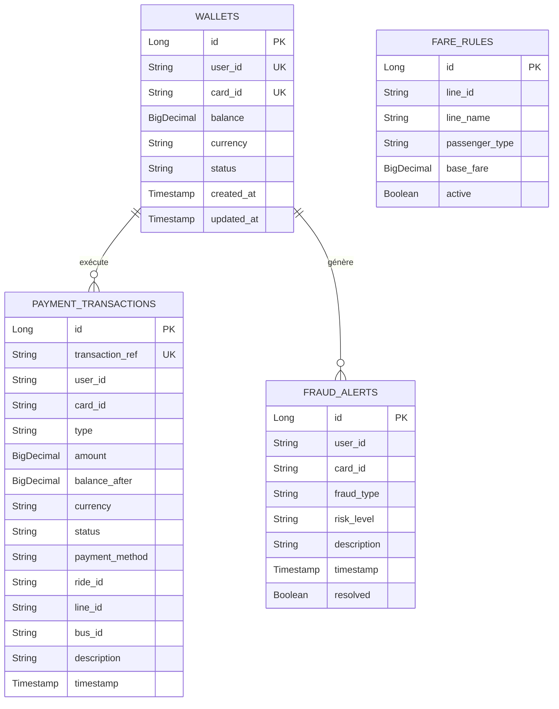

# Documentation Technique - Payment Service (Groupe 3)

## 📌 1. Présentation du Microservice
Le **Payment Service** est un microservice Java Spring Boot autonome développé pour le système intelligent de transport public (inspiré du réseau de bus d'Abu Dhabi). 

Il gère les opérations financières indispensables :
- Portefeuille électronique (Wallets) et soldes virtuels.
- Simulation de recharge via **Wave Mobile Money**.
- Traitement en temps réel des débits de trajets bus (interaction avec le *Transport Service* du Groupe 2).
- Calculateur automatique de tarifs selon les règles par ligne et profil passager.
- Remboursements de trajets (Option Bonus).
- Centre de détection des fraudes et alertes de sécurité (Option Bonus).
- Tableau de bord des statistiques d'utilisation (Option Bonus).

---

## 🏗️ 2. Architecture Technique

- **Version Backend :** Java 17 / 21 LTS - Spring Boot 3.2.5
- **Port Backend :** `8083`
- **Frontend :** Angular 17+ (Port `4200`)
- **Sécurité :** Spring Security 6 + JWT (JSON Web Tokens)
- **Base de Données :** Base relationnelle (H2 In-Memory pour dev/démo rapide + MySQL/PostgreSQL ready)
- **Documentation API :** Swagger UI / OpenAPI 3.0 sur `http://localhost:8083/swagger-ui.html`

---

## 🗄️ 3. Schéma de la Base de Données



---

## 📡 4. En-têtes & Endpoints REST principaux

### Portefeuille & Recharge Wave
* `GET /api/wallet/{userId}` : Obtenir le solde et les détails du portefeuille.
* `POST /api/payments/wave/recharge` : Recharger le solde via la simulation Wave.

### Validation & Débit de Trajet (Interaction Groupe 2 ➔ Groupe 3)
* `POST /api/payments/process-ride` : Appelé par le *Transport Service* lors d'une validation passager (NFC / QR Code).
  * Request Body : `{ "cardId": "CARD_NFC_883921", "lineId": "LINE_01", "rideId": "RIDE_101", "passengerType": "REGULAR" }`
  * Reponse HTTP `200 OK` si solde suffisant, ou `402 Payment Required` si solde insuffisant.

### Tarification & Remboursements
* `POST /api/fares/calculate` : Calcule le tarif de la ligne selon le profil.
* `GET /api/fares/rules` : Liste de toutes les règles tarifaires activées.
* `POST /api/payments/refund` : Effectuer un remboursement d'une transaction.

### Sécurité, Fraude & Stats
* `GET /api/fraud/alerts` : Liste des alertes de sécurité en cours.
* `PUT /api/fraud/resolve/{alertId}` : Marquer une alerte comme résolue.
* `GET /api/stats/dashboard` : Obtenir les métriques financières globales.

---

## 🚀 5. Guide de Lancement Rapide

### 1. Démarrage du Backend Spring Boot
```bash
cd payment-service
mvn spring-boot:run
```
Le backend sera accessible sur `http://localhost:8083`.  
La console H2 est accessible sur `http://localhost:8083/h2-console`.  
La documentation Swagger est accessible sur `http://localhost:8083/swagger-ui.html`.

### 2. Démarrage du Frontend Angular
```bash
cd payment-frontend
npm start
```
L'interface utilisateur Angular sera accessible sur `http://localhost:4200`.
